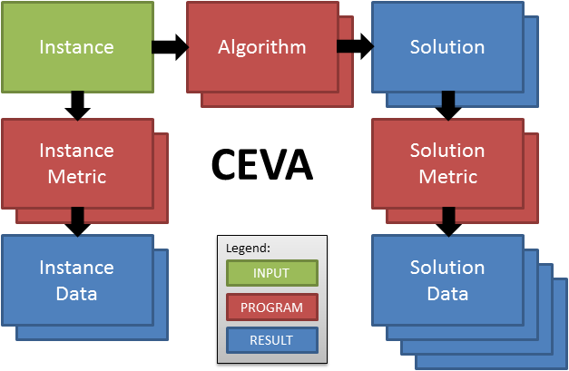

# Basic principles

The main entities of CEVA are:
- `Instance`: A problem instance to solve
- `InstanceMetric`: A command to extract a feature from an `Instance` (typically an external progamm call or a shell command)
- `InstanceData`: The feature value extracted by an `InstanceMetric` for an `Instance`.
- `Algorithm`: A command to execute for an `Instance` that returns a `Solution`.
- `Solution`: The result of an `Instance` calculated by an `Algorithm`.
- `SolutionMetric`: A command to extract a feature from a `Solution`.
- `SolutionData`: The feature value extracted by a `SolutionMetric` from a `Solution`.

On each run CEVA will create the missing results (Solution, InstanceData and SolutionData) by running the programs (InstanceMetric, Algorithm, SolutionMetric) on the corresponding input data (Instance, Solution). All results are stored with the current version of the corresponding program. If you want CEVA to recalculate the results, you have to increase the program's version number.